<div align="center">

# 🅃🄲 Gujarati Fonts

### *Handcrafted Gujarati typefaces for designers, developers & creators*


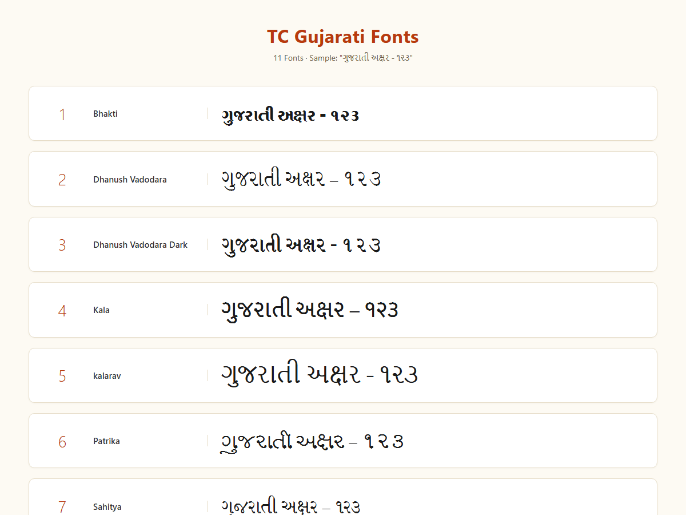

</div>

---

## 📖 About

**TC Gujarati Fonts** is a carefully curated collection of **11 beautiful Gujarati typefaces** for designers, publishers, video editors, and app developers. Each font brings its own personality — from devotional calligraphy to modern display styles — perfect for headlines, posters, invitations, thumbnails, and festive layouts.

> ⚠️ **Please read the [Compatibility & Limitations](#-compatibility--limitations) section before using in production.** These are **display fonts** with limited character sets, not full body-text fonts.

---

## 📑 Table of Contents

- [Font Gallery](#-font-gallery)
- [Compatibility & Limitations](#-compatibility--limitations)
- [Installation](#-installation)
- [Usage](#-usage)
- [Font Details](#-font-details)
- [Repository Structure](#-repository-structure)
- [License](#-license)
- [Contributing](#-contributing)

---

## 🎨 Font Gallery

| # | Font | Preview |
|---|------|---------|
| 1 | **Bhakti** | 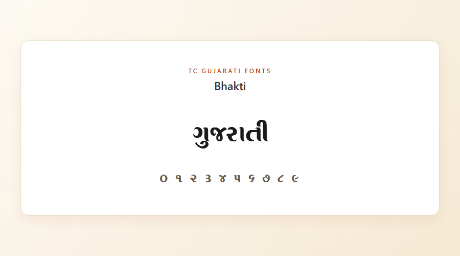 |
| 2 | **Dhanush Vadodara** | 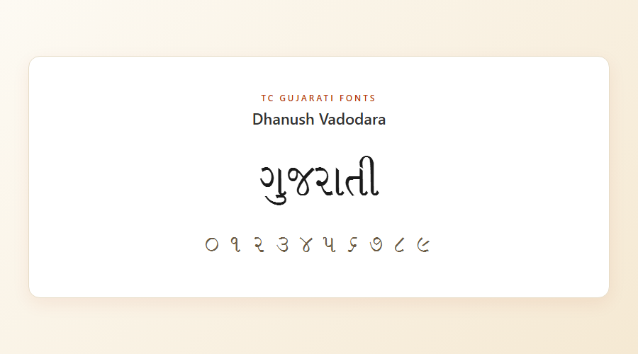 |
| 3 | **Dhanush Vadodara Dark** | 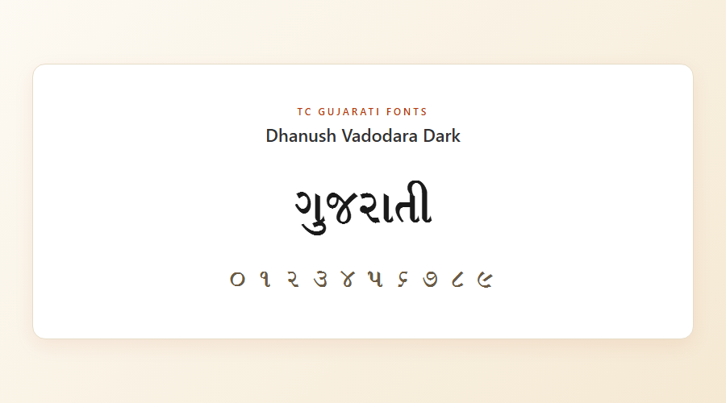 |
| 4 | **Kala** | 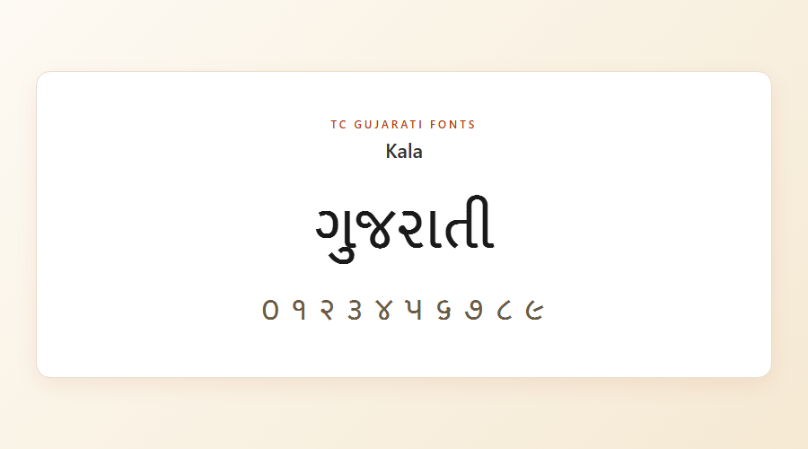 |
| 5 | **Kalarav** | 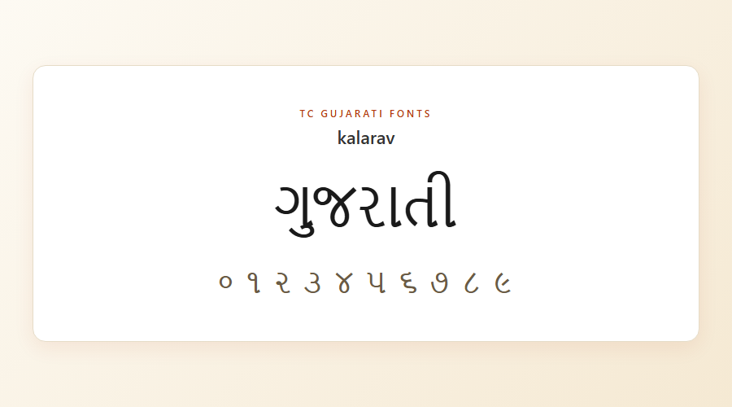 |
| 6 | **Patrika** | 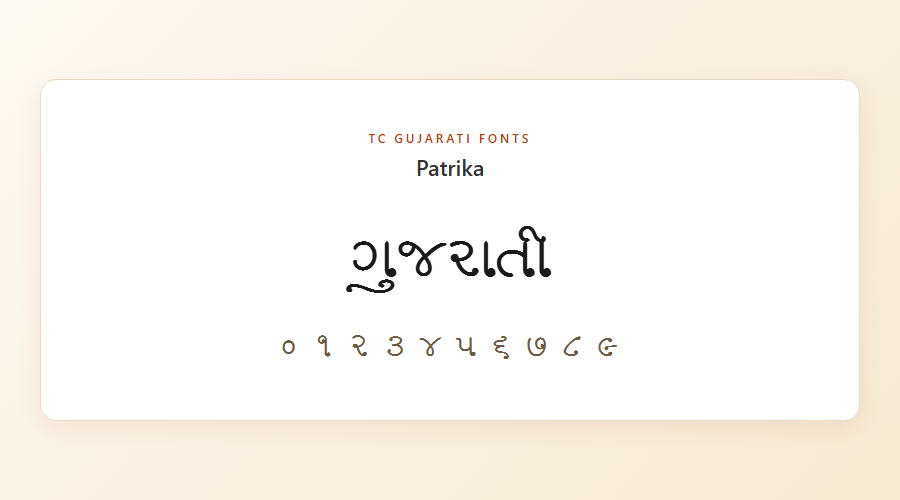 |
| 7 | **Sahitya** | 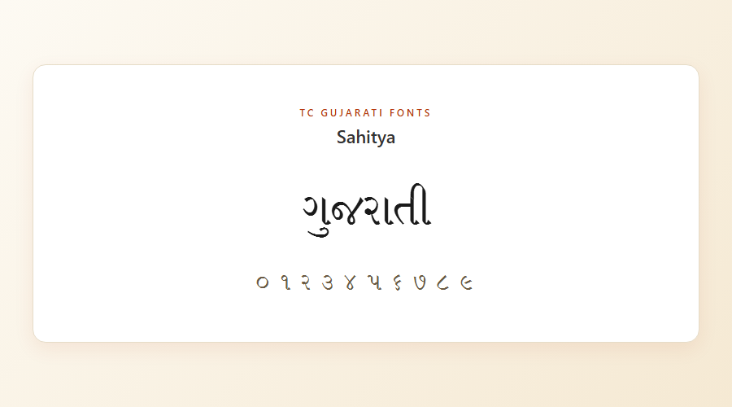 |
| 8 | **Shankar 1** | 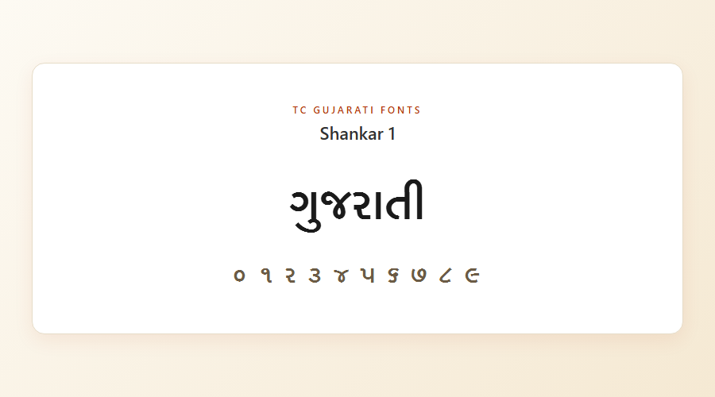 |
| 9 | **Shlock** | 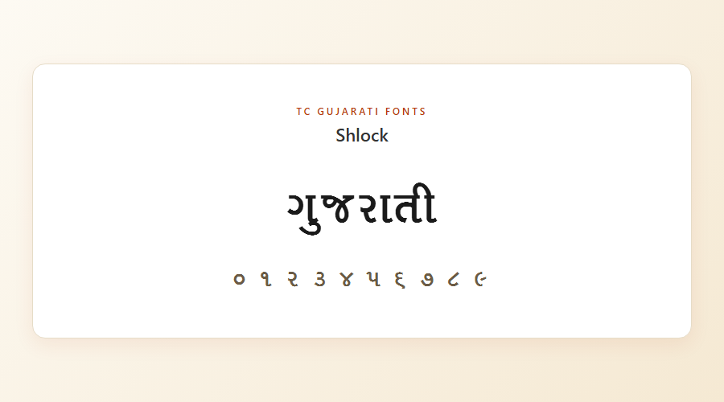 |
| 10 | **Sundar** | 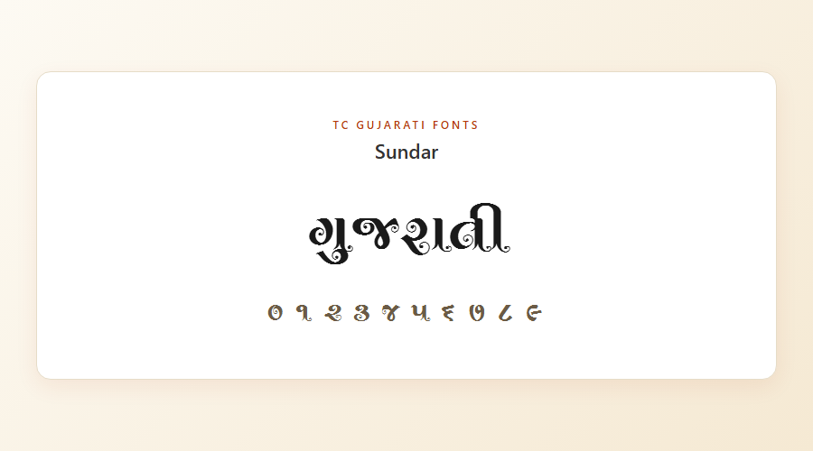 |
| 11 | **Tejas** | 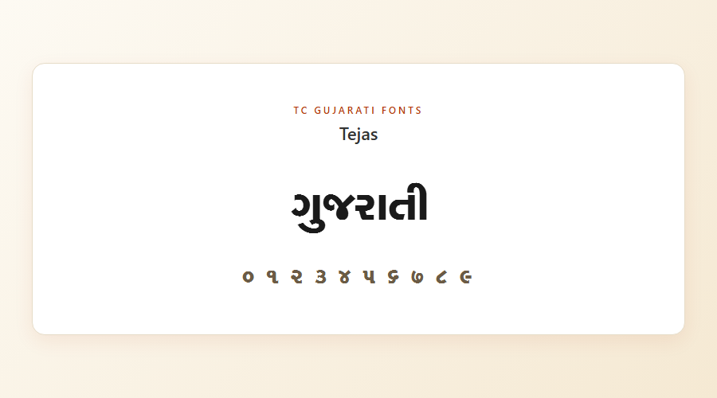 |

---

## ⚠️ Compatibility & Limitations

Before installing, please understand what these fonts can and cannot do.

### 📊 Font Encoding Summary

| Type | Fonts | What it means |
|------|-------|---------------|
| ✅ **Unicode-mapped** | 10 fonts — Bhakti, Dhanush Vadodara, Dhanush Vadodara Dark, Kala, Patrika, Sahitya, Shankar 1, Shlock, Sundar, Tejas | Direct Gujarati Unicode text (`ગુજરાતી`) renders correctly in Word, browsers, apps, and design tools |
| ⚠️ **Legacy ASCII-only** | **Kalarav** | Contains **no Gujarati Unicode glyphs**. You must type English letters using a legacy keyboard mapping to produce Gujarati output. Pasting Unicode Gujarati will show blanks or fallback font |

### 🖥️ Platform Compatibility

| Platform | Installation | Rendering | Notes |
|----------|--------------|-----------|-------|
| **Windows** 10/11 | ✅ Works | ✅ Works in Word, PowerPoint, browsers, Photoshop | Best supported |
| **macOS** | ✅ Works | ✅ Works via Font Book | Fully supported |
| **Linux** | ✅ Works | ✅ Works | Requires modern HarfBuzz / libraqm (present on most 2020+ distros) |
| **Web / CSS** | ✅ `@font-face` | ✅ Works | Verified — see `samples/preview.html` |
| **Android / iOS apps** | ✅ Works | ✅ Works | Recommended for display text only |
| **Flutter** | ✅ Works | ✅ Works | Use for headings and titles, not paragraphs |

### 🚫 Known Limitations

These are **display / decorative fonts**, not general-purpose text fonts. Please note:

1. **Limited character set** — each font contains only ~76 basic Gujarati Unicode characters (consonants, vowels, digits). Rare characters may fall back to the system font.
2. **Complex conjuncts may not shape correctly** — characters like `ક્ષ`, `જ્ઞ`, half-letters (`ર્ક`), and stacked matras rely on OpenType Indic shaping (GSUB / GPOS tables). These fonts have limited shaping support.
3. **Best used for:**
   - Headlines, titles, banners
   - Wedding cards, invitations, festival posters
   - YouTube thumbnails, social media graphics
   - Logos and short display text
4. **Not recommended for:**
   - Long body text (articles, books, ebooks)
   - Legal or official documents requiring perfect script rendering
   - Screen readers / accessibility-critical contexts
5. **For long-form Gujarati content**, use full Unicode fonts like **Noto Sans Gujarati**, **Shruti**, **Lohit Gujarati**, or **Rasa** (available free from Google Fonts).

### 🎹 Special Note on Kalarav (Legacy Font)

Kalarav uses **ASCII-based glyph mapping** (a common convention for older Indian fonts). To type Gujarati with it:

- Install a legacy Gujarati keyboard layout (e.g. **Shree-Lipi**, **Terafont**, or a custom .klc keyboard file)
- Type English letters — the font maps them to Gujarati glyphs visually
- Copy-pasting the visible "Gujarati" text elsewhere without the font will appear as garbled English

If you need Kalarav-style output as real Gujarati Unicode, you'll need a converter tool.

---

## 💾 Installation

<details>
<summary><strong>🪟 Windows</strong></summary>

1. Open the `fonts/` folder
2. Select all `.otf` files (`Ctrl + A`)
3. Right-click → **Install** (or **Install for all users** for system-wide access)

Alternatively, copy the files manually into `C:\Windows\Fonts\`.
</details>

<details>
<summary><strong>🍎 macOS</strong></summary>

1. Double-click any `.otf` file
2. **Font Book** will open → click **Install Font**

Or drag them into `~/Library/Fonts/`.
</details>

<details>
<summary><strong>🐧 Linux</strong></summary>

```bash
mkdir -p ~/.fonts
cp fonts/*.otf ~/.fonts/
fc-cache -fv
```
</details>

<details>
<summary><strong>🌐 Web (CSS)</strong></summary>

```css
@font-face {
  font-family: 'Bhakti';
  src: url('fonts/Bhakti.otf') format('opentype');
  font-display: swap;
}

.gujarati-heading {
  font-family: 'Bhakti', serif;
  font-size: 48px;
}
```
</details>

<details>
<summary><strong>📱 Flutter</strong></summary>

Add to your `pubspec.yaml`:

```yaml
flutter:
  fonts:
    - family: Bhakti
      fonts:
        - asset: assets/fonts/Bhakti.otf
    - family: Tejas
      fonts:
        - asset: assets/fonts/Tejas.otf
```

Use in a widget:

```dart
Text(
  'ગુજરાતી અક્ષર',
  style: TextStyle(fontFamily: 'Bhakti', fontSize: 32),
)
```
</details>

<details>
<summary><strong>📱 React Native</strong></summary>

```js
// Link the assets under Android/iOS folders, then use:
<Text style={{ fontFamily: 'Bhakti', fontSize: 32 }}>
  ગુજરાતી અક્ષર
</Text>
```
</details>

---

## 🚀 Usage

To view live previews locally, start a simple HTTP server:

```bash
python -m http.server 8765
```

Then open in your browser: [http://localhost:8765/samples/preview.html](http://localhost:8765/samples/preview.html)

---

## 📋 Font Details

| Font | Encoding | Style | Best For |
|------|----------|-------|----------|
| Bhakti | Unicode | Devotional / Calligraphic | Religious posters, invitations |
| Dhanush Vadodara | Unicode | Bold Display | Headlines, banners, thumbnails |
| Dhanush Vadodara Dark | Unicode | Extra Bold Display | High-impact titles, video thumbnails |
| Kala | Unicode | Artistic Serif | Cultural posters, art projects |
| Kalarav | ⚠️ Legacy ASCII | Playful Script | Casual designs (requires legacy keyboard) |
| Patrika | Unicode | Editorial Display | Magazine headlines, article titles |
| Sahitya | Unicode | Literary Serif | Book covers, poetry titles |
| Shankar 1 | Unicode | Traditional Bold | Ceremonial content, temples, events |
| Shlock | Unicode | Decorative | Quotes, shayari, social posts |
| Sundar | Unicode | Ornamental Bold | Wedding cards, festive designs |
| Tejas | Unicode | Modern Bold | UI headings, app branding |

> All fonts are intended for **short display text** (titles, headings, posters). For long-form Gujarati body text, use Noto Sans Gujarati or similar full Unicode fonts.

---

## 📁 Repository Structure

```
TC Gujarati Fonts/
├── fonts/                   # Font source files (.otf)
│   ├── Bhakti.otf
│   ├── Dhanush Vadodara.otf
│   └── ... (11 fonts total)
├── samples/                 # Previews and samples
│   ├── all-fonts.png        # Combined preview image
│   ├── preview.html         # Interactive web preview
│   ├── single.html          # Single-font preview page
│   └── individual/          # Per-font preview PNGs
├── docs/                    # Documentation
├── README.md
└── .gitignore
```

---

## 📜 License

All fonts in this collection retain the original copyrights of their respective owners and designers. They are free to use for personal and educational purposes. For **commercial use**, please obtain permission from the original font designers.

---

## 🤝 Contributing

Have a Gujarati font you'd like to add? Contributions are welcome!

1. Fork the repository
2. Add your font file to the `fonts/` folder
3. Add a preview image to `samples/individual/<font-name>.png`
4. Update the gallery table in the README
5. Open a Pull Request

**Format:** `.otf` preferred, `.ttf` also accepted. The font must support proper Gujarati Unicode characters.

---

## 💌 Contact

**Maintainer:** Tejas Chandivakar
**Email:** tejaschandivakar@gmail.com
**GitHub:** [@tejas-chandivakar](https://github.com/tejas-chandivakar)

---

<div align="center">

**⭐ Found this useful? Please star the repo!**

*Made with ❤️ for the Gujarati design community*

</div>
